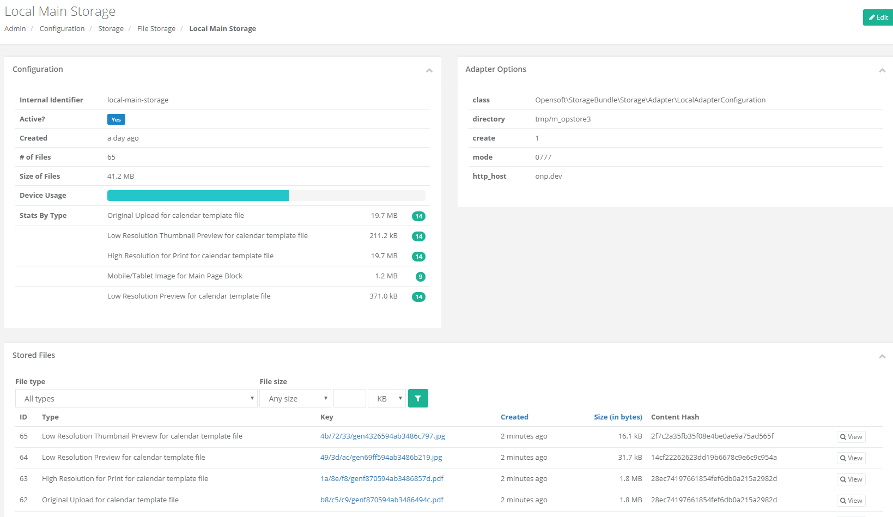
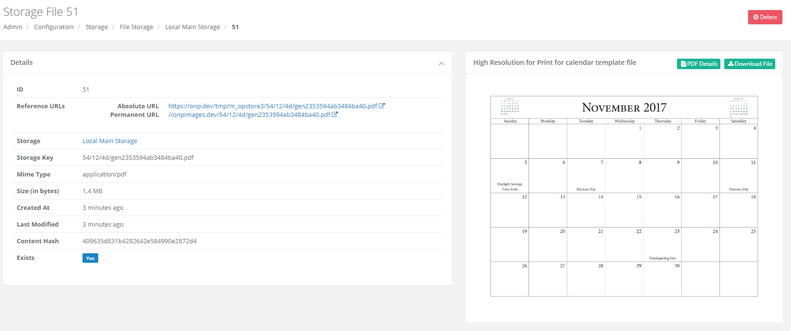
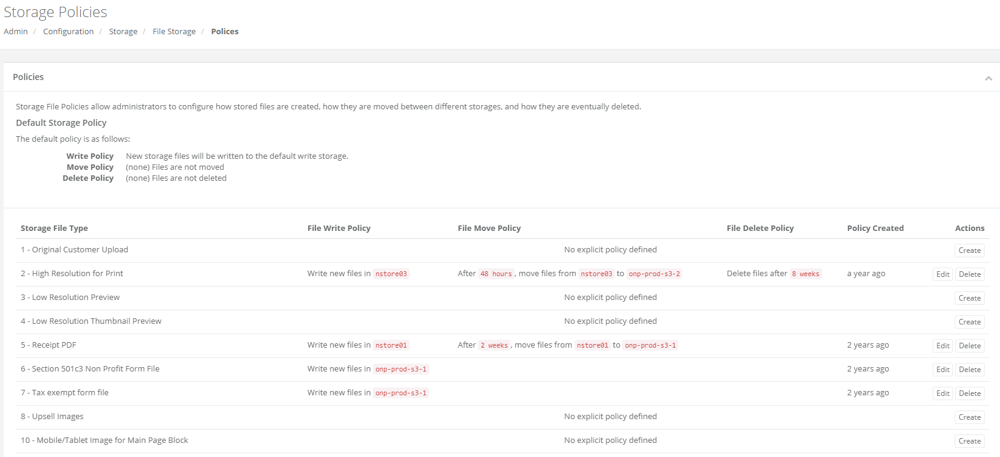

Controllers
===========

This Bundle provides some simple interface screens for managing storage and files.  Add them to your `routing.yml` as follows:


```yaml
opensoft_storage:
    resource: "@OpensoftStorageBundle/Controller/"
    type:     annotation
    prefix:   /
```

Screenshots
-----------

Important Note:  These screenshots were taken of a parent application with a slightly overridden theme than is natively provided
in this bundle.  The parent application uses a Bootstrap3 backed Inspinia Administrative theme for display.  The native templates
provided by this bundle do not look _quite_ as good, but they are still Bootstrap3 backed and fully functional.

**Creating New Storage Space**


**Dashboard / Listing Existing Storage Spaces**


**View Storage Space Details**



**View Storage File Details**



**View Existing Storage File Type Policies**


